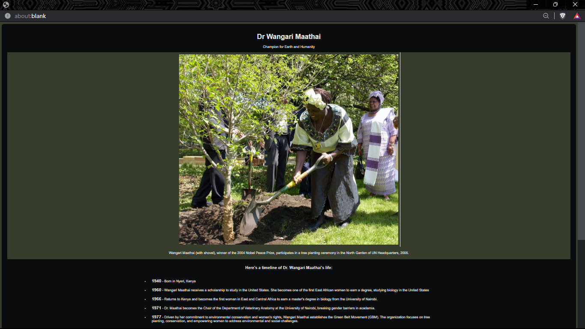

# Dr. Wangari Maathai

## Champion for Earth and Humanity

## Introduction

Welcome to the tribute page dedicated to Dr. Wangari Maathai, a remarkable individual who left an indelible mark as a champion for both the Earth and humanity. This page provides a glimpse into her extraordinary life, achievements, and the legacy she left behind.

git 
## Legacy

Dr. Wangari Maathai's legacy is profound, marked by her dedication to environmental conservation, women's rights, and grassroots activism. The Green Belt Movement continues to thrive, carrying on her vision for a sustainable and equitable world.

## Technologies Used:

HTML CSS 

## How to View

To view the project, simply open the index.html file in your preferred web browser. Feel free to provide any feedback or suggestions!